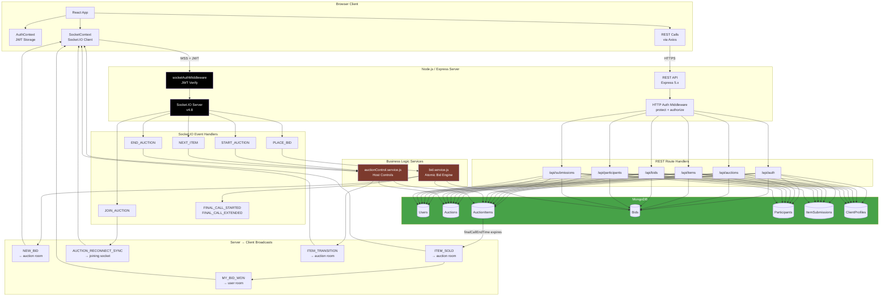

# Vendly

> **Real-Time Multi-Tenant Auction Infrastructure for Premium Commerce**

[](https://react.dev)
[](https://nodejs.org)
[](https://expressjs.com)
[](https://mongodb.com)
[](https://socket.io)
[](https://tailwindcss.com)
[](./LICENSE)

Vendly is a production-grade, dual-layer auction platform purpose-built for high-stakes, real-time commerce. It combines a hardened REST API for lifecycle management with a millisecond-precision WebSocket engine for live bidding, powering luxury auction rooms for watches, classic automobiles, real estate, and fine art.

---

## Table of Contents

1. [What This Product Does](#1-what-this-product-does)
2. [Who It's For](#2-who-its-for)
3. [What It Must NOT Do](#3-what-it-must-not-do)
4. [Core Engine Features](#4-core-engine-features)
5. [Tech Stack](#5-tech-stack)
6. [System Architecture Overview](#6-system-architecture-overview)
7. [Project Structure](#7-project-structure)
8. [Getting Started — Local Setup](#8-getting-started--local-setup)

---

## 1. What This Product Does

Vendly operates as a **SaaS auction infrastructure layer** — conceptually analogous to Shopify for commerce or Zoom for video conferencing, but purpose-engineered for live luxury auction events.

The platform solves a core operational problem: **standard HTTP request-response cycles are fundamentally incompatible with the sub-second timing requirements of a live auction room**. A bid placed with a 200ms network lag in a traditional REST-only system can cause silent race conditions where two bidders simultaneously submit the highest bid, and the server has no reliable mechanism to adjudicate the winner atomically.

Vendly resolves this through a **deliberate dual-layer architecture**:

| Layer | Protocol | Responsibility |
|---|---|---|
| **REST API** | HTTP/HTTPS | Auction lifecycle (create, schedule, update, cancel), item management, participant registration, historical bid records, authentication |
| **Real-Time Engine** | WebSocket (Socket.IO) | Live bid processing, final call timers, anti-sniping extension, room presence, instant event broadcasting to all connected clients |

**The REST layer handles everything that has a permanent record. The WebSocket layer handles everything that happens in the room right now.**

When a participant places a bid, the event travels over the WebSocket connection to the server, is validated against the database using an **atomic MongoDB query** that prevents race conditions at the database layer, committed to the bid ledger, and then broadcast back to every client in the auction room within a single event cycle — all without a single HTTP request.

---

## 2. Who It's For

Vendly is built around **three distinct user personas**, each with a hardened role boundary enforced at the middleware layer.

### Platform Administrators (`role: admin`)
Internal operators who govern the overall platform. Admins approve or reject Client accounts via a dedicated review queue before those accounts can create public auction rooms. They have elevated access to all client profiles and approval workflows.

### Clients / Auction Hosts (`role: client`)
The primary revenue-generating persona. A Client is an auction house, independent dealer, or institutional seller who creates and runs auction rooms. Clients:
- Create and schedule auction rooms with configurable timing rules (final call duration, anti-sniping extension, bid cooldown)
- Add, order, and manage auction items before and during a live event
- Operate the **Host Control Panel** to start the auction, transition between items, trigger final call, and close the room
- Review and approve or reject participant-submitted items via a real-time moderation queue
- Access a dedicated **Host View** panel showing the live leaderboard, item status controls, and the full auction bid history

### Participants / Bidders (`role: participant`)
End users who join live auction rooms to bid on items. Participants:
- Browse and view public auction rooms without authentication
- Authenticate to join a live room, which registers their presence in the participant roster
- Place bids through the WebSocket engine with real-time feedback, outbid notifications, and cooldown enforcement
- Submit items for host consideration from within a live or scheduled room
- Track their full bid history — grouped by Winning, Active, Outbid, and Other status — via the My Bids dashboard, which updates in real time via socket events

---

## 3. What It Must NOT Do

Understanding scope boundaries is as important as understanding capabilities. Vendly is explicitly **not** the following:

- **Not a general-purpose e-commerce shopping cart.** There is no product catalog, no add-to-cart flow, and no checkout funnel. Every item exists within the context of a timed auction room.
- **Not a payment processing platform.** Vendly does not handle payment collection, escrow, invoicing, or financial settlements. Winning bid records are stored as data; payment fulfillment is the responsibility of an integrated downstream system.
- **Not a physical logistics or shipping platform.** The platform has no concept of inventory location, warehouse management, shipping carriers, or delivery tracking.
- **Not a content delivery network or media storage service.** Item images are referenced by URL. The platform does not host, transcode, or serve binary assets.
- **Not a synchronous video streaming platform.** The WebSocket layer carries structured JSON events, not audio or video streams. Live video of the auction room, if required, is an external integration concern.
- **Not a public blockchain or NFT marketplace.** Bid records are stored in MongoDB and are authoritative within the platform's own data boundary.

---

## 4. Core Engine Features

### 4.1 Atomic Bidding Engine — Race Condition Prevention

> The single most critical engineering guarantee in a live auction system is that exactly one bidder can hold the highest bid at any point in time.

In a naive implementation, two participants submitting identical bids within the same millisecond window would both read the same `currentHighestBid` value, both pass the validation check, and both write their bid — producing a corrupted auction state with two simultaneous "winners."

Vendly eliminates this class of bug entirely at the **database query layer** using MongoDB's atomic `findOneAndUpdate` with a conditional filter:

```javascript
// From: backend/src/services/bid.service.js
const updatedItem = await AuctionItem.findOneAndUpdate(
  {
    _id: itemId,
    status: "live",
    currentHighestBid: { $lt: bidAmount }, // ← The atomic concurrency guard
  },
  {
    currentHighestBid: bidAmount,
    currentHighestBidder: bidderId,
    $inc: { bidCount: 1 },
  },
  { new: true }
);

if (!updatedItem) {
  throw new Error("You were outbid! The current bid has already increased.");
}
```

The `$lt: bidAmount` condition means MongoDB will only apply the write **if the current highest bid in the database is still less than the incoming bid at the exact moment of the write**. If two bids arrive simultaneously, the database serializes them internally, the first one succeeds, and the second one finds that the condition is no longer satisfied and returns `null` — which the application surfaces as an outbid error. No application-level locks, no distributed semaphores, no eventual consistency tradeoffs.

---

### 4.2 Algorithmic Anti-Sniping System

> A live auction with a hard countdown timer is exploitable: a participant can wait until the final second and place an uncontestable bid. Vendly's anti-sniping engine eliminates this exploit.

When the auction host initiates a **Final Call** for a live item, a countdown timer begins. If any bid is placed while the Final Call timer is active, the engine automatically extends the timer by a configurable number of seconds (`antiSnipingExtension`, default: 10 seconds). This ensures every participant has a fair opportunity to respond to last-second bids.

The extension logic is atomic:

```javascript
// From: backend/src/services/bid.service.js
const extendedItem = await AuctionItem.findOneAndUpdate(
  {
    _id: itemId,
    status: "live",
    isFinalCall: true,
    $or: [
      { finalCallEndTime: null },
      { finalCallEndTime: { $lt: newEndTime } },
    ],
  },
  { finalCallEndTime: newEndTime },
  { new: true }
);
```

The `$lt: newEndTime` condition ensures an extension only applies if it would actually move the deadline forward — preventing duplicate extension events from multiple near-simultaneous bids from compounding incorrectly. The extended deadline is then broadcast to all clients in the room via a `FINAL_CALL_EXTENDED` Socket.IO event, and the frontend timer updates in real time.

The countdown is rendered client-side using a 100ms interval tick driven by the server-provided `finalCallEndTime` timestamp, ensuring all clients converge on the same deadline regardless of when they connected.

---

### 4.3 Sub-50ms Real-Time WebSocket Layer

The real-time engine is built on **Socket.IO 4.8** with the following architectural characteristics:

**Room-scoped broadcasting.** Every auction room is a Socket.IO room keyed by `auction_${auctionId}`. When a bid is confirmed, the server emits to the room, not to individual sockets — ensuring O(1) broadcast complexity regardless of participant count.

**Personal user rooms.** Each authenticated socket additionally joins `user_${userId}`, enabling private delivery of sensitive events like `MY_BID_WON` and `MY_BID_UPDATE` without broadcasting to the full room.

**Reconnection synchronization.** When a client reconnects or joins mid-auction, the server immediately emits an `AUCTION_RECONNECT_SYNC` payload containing the current active item, remaining time, and Final Call state. The client resolves its local state against this payload, preventing stale UI after network interruptions.

**Bid cooldown enforcement (server + client).** A configurable per-user bid cooldown (default: 3 seconds) is enforced on the server using an in-memory Map keyed by `userId_auctionId`. The client mirrors this with a 100ms interval countdown displayed in the bid controls, providing immediate user feedback without requiring a server round-trip.

**Auction item watcher.** A server-side `setInterval` (750ms tick) monitors live items for expired `finalCallEndTime`. When the deadline passes, the server automatically finalizes the item as `sold` or `unsold`, emits `ITEM_SOLD`, and transitions to the next item — or ends the auction if no items remain. This ensures auction progression is not dependent on the host manually advancing.

---

### 4.4 Multi-Tenant Host Control Architecture

Each auction room is owned exclusively by the Client who created it. Host identity is verified on every privileged operation:

```javascript
// From: backend/src/services/auctionControl.service.js
const verifyHost = async (auctionId, userId) => {
  const auction = await Auction.findById(auctionId);
  if (auction.createdBy.toString() !== userId.toString()) {
    throw new Error("Unauthorized: Only the host can control this auction");
  }
  return auction;
};
```

Socket-level host commands (`START_AUCTION`, `NEXT_ITEM`, `END_AUCTION`) pass through `verifyHost` before any state mutation occurs, ensuring no participant or unauthenticated socket can issue control commands.

---

### 4.5 Item Submission & Moderation Queue

Participants can submit items for consideration within a live or scheduled auction room. Submissions enter a **pending moderation queue** visible only to the host via `SubmissionReviewPanel`. The host receives real-time notifications via `SUBMISSION_CREATED` socket events and can approve or reject items. On approval, a new `AuctionItem` document is created from the submission and added to the auction's item roster automatically. The submitting participant receives a `SUBMISSION_APPROVED` or `SUBMISSION_REJECTED` event targeted to their personal socket room.

---

### 4.6 Security & Compliance Layer

| Control | Implementation |
|---|---|
| **Authentication** | JWT (`jsonwebtoken 9.x`) with `Bearer` token scheme; `select: false` on password field prevents accidental exposure |
| **Password hashing** | `bcrypt` with salt rounds of 10 via a Mongoose pre-save hook |
| **Rate limiting** | `express-rate-limit` — 100 requests / 15 minutes in production, applied to all `/api` routes |
| **NoSQL injection prevention** | `express-mongo-sanitize` applied to `req.body` and `req.params` on every request |
| **Security headers** | `helmet` sets `X-Content-Type-Options`, `X-Frame-Options`, `Content-Security-Policy`, and related headers |
| **Request size limiting** | Body parser capped at `10kb` to prevent payload-based denial-of-service |
| **Input validation** | `express-validator` with explicit schema rules on auth registration routes |
| **Role-based access control** | `authorize(...roles)` middleware enforces `admin`, `client`, and `participant` role boundaries on every protected route |
| **Socket authentication** | `socketAuthMiddleware` validates JWT from `socket.handshake.auth.token`, `Authorization` header, or query parameter before any socket event is processed |

---

### 4.7 Auction State Machine

Auctions transition through a formally defined state graph. Invalid transitions are rejected at the controller layer:

```
draft ──► scheduled ──► live ──► ended
  │           │           │
  └──► cancelled ◄────────┘
```

```javascript
// From: backend/src/controllers/auction.controller.js
const validTransitions = {
  draft:     ["scheduled", "cancelled"],
  scheduled: ["live", "cancelled", "draft"],
  live:      ["ended", "cancelled"],
  ended:     [],      // Terminal state
  cancelled: [],      // Terminal state
};
```

---

## 5. Tech Stack

### Frontend
| Technology | Version | Role |
|---|---|---|
| React | 19.x | UI component framework |
| React Router DOM | 7.x | Client-side routing |
| Vite | 8.x | Build tooling and dev server |
| Tailwind CSS | 4.x | Utility-first styling |
| Socket.IO Client | 4.8 | WebSocket connection |
| Axios | 1.x | HTTP client for REST API |
| React Hot Toast | 2.x | Non-blocking toast notifications |
| Lucide React | 0.577 | Icon system |

### Backend
| Technology | Version | Role |
|---|---|---|
| Node.js | 20+ | Runtime |
| Express | 5.x | HTTP framework |
| Socket.IO | 4.8 | WebSocket server |
| Mongoose | 9.x | MongoDB ODM |
| jsonwebtoken | 9.x | JWT issuance and verification |
| bcrypt | 6.x | Password hashing |
| Helmet | 8.x | Security headers |
| express-rate-limit | 8.x | API rate limiting |
| express-mongo-sanitize | 2.x | NoSQL injection prevention |
| express-validator | 7.x | Input validation |
| Morgan | 1.x | HTTP request logging |
| dotenv | 17.x | Environment variable management |

### Database & Infrastructure
| Technology | Role |
|---|---|
| MongoDB | Primary document store for all auction, item, bid, user, and participant data |
| Mongoose Indexes | Compound and single-field indexes on `auctionId`, `status`, `createdBy`, `bidAmount` for query performance |

---

## 6. System Architecture Overview

### Data Flow Narrative

When a participant loads an auction room page, the frontend issues **two parallel HTTP requests** to the REST API: one for the auction document and one for the items roster. These responses populate the initial UI. Simultaneously, the Socket.IO client (managed by `SocketContext`) establishes a persistent WebSocket connection and authenticates using the stored JWT.

Once the socket is connected, the client emits `JOIN_AUCTION` with the auction ID. The server adds the socket to the room `auction_${auctionId}` and immediately responds with `AUCTION_RECONNECT_SYNC` — a snapshot of the current live item and timer state. From this point forward, **all bid activity, item transitions, and timer events are exclusively delivered over WebSocket**. The REST layer is not involved in the live auction loop.

When the auction host advances to the next item or ends the auction, a WebSocket event propagates the transition to all connected clients simultaneously. The host's browser makes no additional HTTP requests — the Socket.IO emit on the server triggers the state change and the broadcast in a single operation.

Historical data (bid history, leaderboard) is fetched via REST on initial page load and then kept current by appending incoming `NEW_BID` socket events to local React state.

---

### Architecture Diagram



---

### Socket Event Reference

| Event | Direction | Description |
|---|---|---|
| `JOIN_AUCTION` | Client → Server | Join the auction room and receive reconnect sync |
| `LEAVE_AUCTION` | Client → Server | Leave the auction room |
| `PLACE_BID` | Client → Server | Submit a bid; receives ack callback |
| `START_AUCTION` | Host → Server | Transition auction to live and activate first item |
| `NEXT_ITEM` | Host → Server | Finalize current item and activate next |
| `END_AUCTION` | Host → Server | Close the auction and mark remaining items unsold |
| `NEW_BID` | Server → Room | Broadcast confirmed bid with updated item state |
| `BID_ERROR` | Server → Socket | Deliver bid rejection reason to bidder only |
| `BID_COOLDOWN_ACTIVE` | Server → Socket | Notify bidder cooldown is active |
| `ITEM_STATUS_UPDATED` | Server → Room | Deliver updated item list after status change |
| `ITEM_SOLD` | Server → Room | Announce item sale with winner and amount |
| `ITEM_TRANSITION` | Server → Room | Signal move to next item with full item payloads |
| `FINAL_CALL_STARTED` | Server → Room | Begin final call countdown on active item |
| `FINAL_CALL_EXTENDED` | Server → Room | Push updated deadline after anti-snipe extension |
| `AUCTION_STARTED` | Server → Room | Confirm auction is live with first active item |
| `AUCTION_ENDED` | Server → Room | Signal auction close; evict sockets from room |
| `MY_BID_WON` | Server → User Room | Private win notification to winning bidder |
| `MY_BID_UPDATE` | Server → User Room | Private bid confirmation to bidder |
| `AUCTION_JOINED` | Server → Room | Notify room of new participant joining |
| `AUCTION_RECONNECT_SYNC` | Server → Socket | Deliver current state snapshot on join/reconnect |
| `SUBMISSION_CREATED` | Server → Room | Notify host of new item submission |
| `SUBMISSION_APPROVED` | Server → Room | Confirm submission approval to host and submitter |
| `SUBMISSION_REJECTED` | Server → Room | Confirm submission rejection to host and submitter |

---

## 7. Project Structure

```
vendly-2.0/
│
├── backend/                          # Node.js / Express API Server
│   ├── package.json                  # Dependencies: express, mongoose, socket.io, bcrypt, etc.
│   └── src/
│       ├── server.js                 # Entry point: HTTP server, Socket.IO init, DB connect
│       ├── app.js                    # Express app: middleware stack, route mounting
│       │
│       ├── config/
│       │   ├── database.js           # Mongoose connection
│       │   └── socket.js             # (Socket config placeholder)
│       │
│       ├── models/                   # Mongoose schemas
│       │   ├── user.model.js         # User: name, email, password (hashed), role
│       │   ├── auction.model.js      # Auction: title, status state machine, timing rules
│       │   ├── auctionItem.model.js  # AuctionItem: price, bidder, status, final call fields
│       │   ├── bid.model.js          # Bid: amount, bidder, item, status (valid/winning/outbid)
│       │   ├── auctionParticipant.model.js  # Participant roster per auction
│       │   ├── clientProfile.model.js       # Client org profile and approval status
│       │   └── itemSubmission.model.js      # Participant-submitted item for moderation
│       │
│       ├── controllers/              # Request handlers (route → response)
│       │   ├── auth.controller.js          # register, login, getMe, logout
│       │   ├── auction.controller.js       # CRUD + state machine transitions
│       │   ├── auctionItem.controller.js   # Item CRUD + status control + Socket.IO emit
│       │   ├── auctionParticipant.controller.js  # Join auction, list participants
│       │   ├── bid.controller.js           # Bid history queries
│       │   ├── client.controller.js        # Client profile + admin approval flow
│       │   └── itemSubmission.controller.js      # Submit, approve, reject items
│       │
│       ├── routes/                   # Express routers
│       │   ├── auth.routes.js
│       │   ├── auction.routes.js
│       │   ├── item.routes.js
│       │   ├── bid.routes.js
│       │   ├── client.routes.js
│       │   ├── participant.routes.js
│       │   └── itemSubmission.routes.js
│       │
│       ├── middlewares/
│       │   ├── authMiddleware.js         # protect (JWT verify) + authorize (RBAC)
│       │   ├── socketAuthMiddleware.js   # Socket.IO JWT authentication
│       │   └── errorMiddleware.js        # Global error handler + 404 handler
│       │
│       ├── services/                 # Core business logic (no HTTP dependencies)
│       │   ├── bid.service.js        # Atomic bid engine: $lt guard + anti-snipe extension
│       │   └── auctionControl.service.js  # Host control: start, next item, end auction
│       │
│       ├── sockets/
│       │   └── auction.socket.js     # All Socket.IO event handlers, timers, watchers
│       │
│       ├── utils/
│       │   ├── generateToken.js      # JWT issuance
│       │   └── bidCooldown.js        # In-memory cooldown Map: canPlaceBid, updateBidTime
│       │
│       └── validations/
│           └── auth.validation.js    # express-validator rules for registration
│
└── frontend/                         # React 19 / Vite SPA
    ├── package.json                  # Dependencies: react, socket.io-client, axios, tailwind
    ├── vite.config.js                # Vite + Tailwind plugin config
    ├── tailwind.config.js            # Brand color tokens, font families, animations
    ├── index.html
    └── src/
        ├── main.jsx                  # React root: BrowserRouter, AuthProvider, Toaster
        ├── App.jsx                   # Route definitions
        ├── index.css                 # Tailwind directives + global base styles
        │
        ├── context/
        │   ├── AuthContext.jsx       # JWT persistence, login/register/logout, session hydration
        │   └── SocketContext.jsx     # Singleton Socket.IO connection, auth token injection
        │
        ├── lib/
        │   └── axios.js              # Axios instance: baseURL from env, JWT interceptor
        │
        ├── hooks/                    # Encapsulated stateful logic
        │   ├── useAuctionRoomData.js         # REST fetch: auction + items on mount
        │   ├── useAuctionRoomSocketEvents.js # All room-scoped socket event handlers
        │   ├── useAuctionRoomPresence.js     # Join/leave room, host auto-join
        │   ├── useAuctionRoomItemActions.js  # Add/edit/delete/status item operations
        │   ├── useFinalCallTimer.js          # Client-side countdown driven by server timestamps
        │   ├── useFinalCallPreview.js        # Dev-only Final Call UI test harness
        │   ├── useBidCooldown.js             # Cooldown countdown from socket events
        │   └── usePendingSubmissionIds.js    # Host submission badge count
        │
        ├── pages/
        │   ├── HomePage.jsx          # Landing page with section composition
        │   ├── AuthPage.jsx          # Login / Register dual-mode form
        │   ├── LiveAuctionsPage.jsx  # Public auction browser (live + upcoming)
        │   ├── MyAuctionsPage.jsx    # Client: hosted auction management dashboard
        │   ├── MyBidsPage.jsx        # Participant: real-time bid history by status
        │   ├── CreateAuctionPage.jsx # Client: auction creation form
        │   ├── AuctionRoom.jsx       # Primary auction room: items, join, host controls
        │   ├── LiveRoomPage.jsx      # Live room board: leaderboard, bid history, items
        │   ├── AuctionItemPage.jsx   # Focused single-item bid view with history
        │   └── InfoPage.jsx          # Generic info page for nav routes
        │
        ├── components/
        │   ├── layout/
        │   │   ├── Navbar.jsx        # Responsive nav: auth state, role-aware quick links
        │   │   └── Footer.jsx        # Link columns, social icons, copyright
        │   │
        │   ├── auction/              # Auction room sub-components
        │   │   ├── AuctionRoomHeader.jsx         # Cover image, status, timing rule badges
        │   │   ├── AuctionJoinPanel.jsx           # Join CTA or Live Room button
        │   │   ├── AuctionHostControlPanel.jsx    # Start/Next/End + submission review toggle
        │   │   ├── AuctionItemControlsPanel.jsx   # Per-item bid input + host status controls
        │   │   ├── AuctionAddItemForm.jsx          # Host item creation form
        │   │   ├── AuctionSubmitItemPanel.jsx      # Participant item submission toggle
        │   │   ├── SubmissionReviewPanel.jsx       # Host moderation queue with approve/reject
        │   │   ├── SubmitItemForm.jsx              # Participant submission form
        │   │   ├── RoomHeaderSkeleton.jsx          # Loading skeleton for room header
        │   │   └── ItemSkeleton.jsx                # Loading skeleton for item cards
        │   │
        │   ├── sections/             # Homepage section components
        │   │   ├── Hero.jsx          # Panoramic image gallery + headline
        │   │   ├── LiveAuctions.jsx  # Horizontal scroll auction cards from API
        │   │   ├── PremiumLots.jsx   # Featured item grid
        │   │   ├── TopHosts.jsx      # Host mosaic cards with follow state
        │   │   ├── AuctionInsights.jsx  # Editorial news bento grid
        │   │   ├── UpcomingEvents.jsx   # Event card grid
        │   │   └── Newsletter.jsx    # Email subscription + gallery strip
        │   │
        │   └── ui/                   # Primitive and shared UI components
        │       ├── Button.jsx              # Variant system: primary, secondary, rust, ghost
        │       ├── ItemCard.jsx            # Auction item card (sale + featured variants)
        │       ├── FinalCallBanner.jsx     # Countdown timer banner with urgency states
        │       ├── SocketStatusBadge.jsx   # Live / Reconnecting connection indicator
        │       ├── SectionHeader.jsx       # Section title + view-all link
        │       └── InsightCard.jsx         # Editorial card variants (small, hero, text)
        │
        ├── data/
        │   ├── mockData.js           # Static fallback data for homepage sections
        │   └── routePages.js         # Route definitions for info pages
        │
        └── utils/
            └── auctionRoom.utils.js  # Shared formatters: currency, time, item mapping
```

---

## 8. Getting Started — Local Setup

### Prerequisites

Ensure the following are installed on your machine:

- **Node.js** `>= 20.19.0`
- **npm** `>= 10.x`
- **MongoDB** (local instance on `mongodb://localhost:27017` or a MongoDB Atlas connection string)

---

### Step 1 — Clone the Repository

```bash
git clone https://github.com/your-org/vendly-2.0.git
cd vendly-2.0
```

---

### Step 2 — Configure Backend Environment

Navigate to the backend directory and create your environment file:

```bash
cd backend
cp .env.example .env   # or create .env manually
```

Populate `.env` with the following variables:

```env
# Server
PORT=5000
NODE_ENV=development

# Database
MONGO_URI=mongodb://localhost:27017/vendly

# Authentication
JWT_SECRET=your-256-bit-secret-key-here
JWT_EXPIRE=7d
```

> **Security Note:** `JWT_SECRET` must be a cryptographically random string of at least 32 characters. In production, generate it with `node -e "console.log(require('crypto').randomBytes(32).toString('hex'))"`.

---

### Step 3 — Install Backend Dependencies

```bash
# Still inside /backend
npm install
```

---

### Step 4 — Start the Backend Server

```bash
# Development (with hot reload via nodemon)
npm run dev

# Production
npm start
```

The REST API will be available at `http://localhost:5000/api`.
The Socket.IO server will be available at `http://localhost:5000`.

Confirm the server is running:

```bash
curl http://localhost:5000/api/health
# → {"success":true,"message":"Vendly API is running..."}
```

---

### Step 5 — Configure Frontend Environment

Open a new terminal and navigate to the frontend directory:

```bash
cd ../frontend
```

Create a `.env` file:

```env
# REST API base URL (must end with /api)
VITE_API_URL=http://localhost:5000/api

# WebSocket server URL (no /api suffix)
VITE_SOCKET_URL=http://localhost:5000
```

---

### Step 6 — Install Frontend Dependencies

```bash
npm install
```

---

### Step 7 — Start the Frontend Dev Server

```bash
npm run dev
```

The application will be available at `http://localhost:5173`.

---

### Step 8 — Seed Initial Data (Optional)

Vendly does not ship a database seeder. To start exploring the platform, register accounts through the UI:

1. Register a **Participant** account at `/auth?mode=register` (default role)
2. Register a **Client** account at `/auth?mode=register` — select "Client (Host)" from the role dropdown
3. Log in as the Client and navigate to `/create-auction` to create your first auction room
4. Add items to the auction from the Auction Room page
5. Transition the auction to `scheduled` status, then start it from the Host Control Panel

> **Note on Admin Accounts:** The `admin` role can only be assigned directly in the database or via a seeding script. To create an admin, register a user normally then update the `role` field in MongoDB: `db.users.updateOne({ email: "admin@example.com" }, { $set: { role: "admin" } })`.

---

### Available Scripts

#### Backend (`/backend`)

| Command | Description |
|---|---|
| `npm start` | Start server with `node` (production) |
| `npm run dev` | Start server with `nodemon` (development, hot reload) |

#### Frontend (`/frontend`)

| Command | Description |
|---|---|
| `npm run dev` | Start Vite dev server with HMR |
| `npm run build` | Build production bundle to `/dist` |
| `npm run preview` | Serve production build locally |
| `npm run lint` | Run ESLint across all source files |

---

## License

Distributed under the **ISC License**. See `LICENSE` for details.

---

<div align="center">
  <strong>Vendly</strong> — Built for the room where the bid happens.
</div>